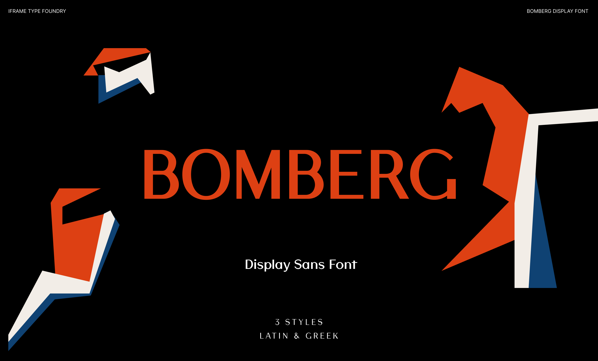

# Bomberg Sans

[![][Fontbakery]](https://googlefonts.github.io/googlefonts-project-template/fontbakery/fontbakery-report.html)
[![][Universal]](https://googlefonts.github.io/googlefonts-project-template/fontbakery/fontbakery-report.html)
[![][GF Profile]](https://googlefonts.github.io/googlefonts-project-template/fontbakery/fontbakery-report.html)
[![][Outline Correctness]](https://googlefonts.github.io/googlefonts-project-template/fontbakery/fontbakery-report.html)
[![][Shaping]](https://googlefonts.github.io/googlefonts-project-template/fontbakery/fontbakery-report.html)

[Fontbakery]: https://img.shields.io/endpoint?url=https%3A%2F%2Fraw.githubusercontent.com%2Fiframefonts%2Fbomberg-sans%2Fgh-pages%2Fbadges%2Foverall.json
[GF Profile]: https://img.shields.io/endpoint?url=https%3A%2F%2Fraw.githubusercontent.com%2Fiframefonts%2Fbomberg-sans%2Fgh-pages%2Fbadges%2FGoogleFonts.json
[Outline Correctness]: https://img.shields.io/endpoint?url=https%3A%2F%2Fraw.githubusercontent.com%2Fiframefonts%2Fbomberg-sans%2Fgh-pages%2Fbadges%2FOutlineCorrectnessChecks.json
[Shaping]: https://img.shields.io/endpoint?url=https%3A%2F%2Fraw.githubusercontent.com%2Fgooglefonts%2Fbomberg-sans%2Fgh-pages%2Fbadges%2FShapingChecks.json
[Universal]: https://img.shields.io/endpoint?url=https%3A%2F%2Fraw.githubusercontent.com%2Fgooglefonts%2Fbomberg-sans%2Fgh-pages%2Fbadges%2FUniversal.json

Inspired by David Bomberg’s “The Mud Bath”

Immerse yourself in the world of art and typography with Bomberg Serif Font by iframe type foundry. Inspired by the legendary David Bomberg’s iconic painting, “The Mud Bath.” Just as Bomberg’s brush strokes conveyed raw emotion and creativity, our font captures that very essence in each meticulously crafted letterform.

Unleash your creativity, tell your story, and make your designs a work of art with Bomberg Serif Font. Explore the intersection of artistry and typography today!

## About

Designer: Georgios Chalkidis  
Company: iframe font foundry

## Building

Fonts are built automatically by GitHub Actions - take a look in the "Actions" tab for the latest build.

If you want to build fonts manually on your own computer:

* `make build` will produce font files.
* `make test` will run [FontBakery](https://github.com/googlefonts/fontbakery)'s quality assurance tests.
* `make proof` will generate HTML proof files.

The proof files and QA tests are also available automatically via GitHub Actions - look at `https://github.io/iframefonts/bomberg-sans`.

## Changelog

When you update your font (new version or new release), please report all notable changes here, with a date.
[Font Versioning](https://github.com/googlefonts/gf-docs/tree/main/Spec#font-versioning) is based on semver. 
Changelog example:

**26 May 2021. Version 2.13**
- MAJOR Font turned to a variable font.
- SIGNIFICANT New Stylistic sets added.

## License

This Font Software is licensed under the SIL Open Font License, Version 1.1.
This license is available with a FAQ at
https://scripts.sil.org/OFL

## Repository Layout

This font repository structure is inspired by [Unified Font Repository v0.3](https://github.com/unified-font-repository/Unified-Font-Repository), modified for the Google Fonts workflow.
